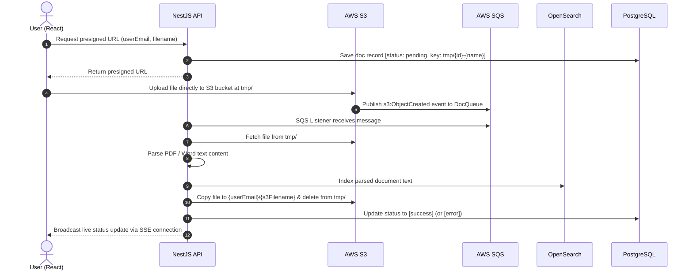

# React & NestJS Document Search Monorepo

Full-stack document upload, processing, indexing, and full-text search application built with NestJS, React, AWS S3, AWS SQS, OpenSearch, and PostgreSQL.

---

## Architecture Flow Overview

---

## Key Features & Lifecycle

1. **Pre-signed Uploads**: Frontend uploads directly to AWS S3 under `tmp/{s3-filename}`.
2. **S3 Lifecycle Rule**: Automatic 24-hour expiration for unprocessed temporary uploads in `tmp/`.
3. **Event-Driven Indexing**: S3 triggers `s3:ObjectCreated:*` events sent to AWS SQS `DocQueue`.
4. **Text Extraction & OpenSearch**: NestJS SQS listener parses PDF/Word text content and indexes full text to OpenSearch with fuzzy search support.
5. **Permanent Storage**: Processed files are moved from `tmp/` to `{userEmail}/{s3-filename}`.
6. **Real-time SSE Status**: Server-Sent Events notify the frontend live as document statuses change from `pending` -> `success` / `error`.
