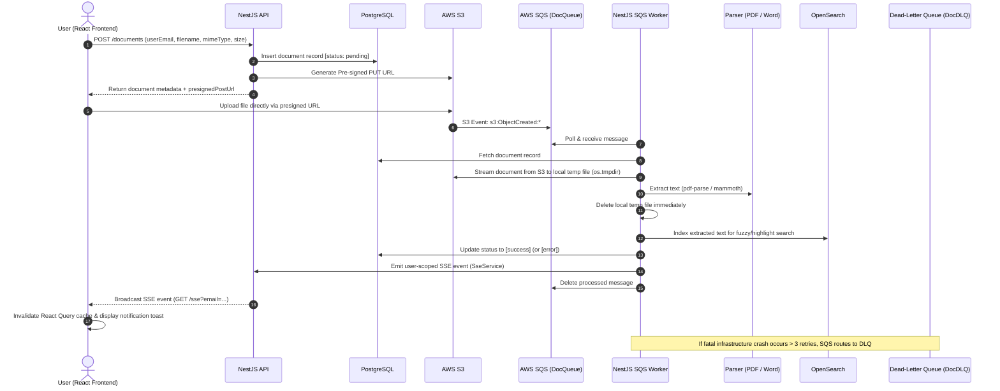

# React & NestJS Document Search Monorepo

Full-stack, event-driven document management, processing, and full-text search application built with **NestJS**, **React**, **AWS S3**, **AWS SQS**, **OpenSearch**, and **PostgreSQL**.

---

## Architecture Flow



---

## Tech Stack

### Backend (`/api`)

- **Framework**: [NestJS 11](https://nestjs.com/) (TypeScript)
- **Database & ORM**: [PostgreSQL 16](https://www.postgresql.org/) with [Drizzle ORM](https://orm.drizzle.team/)
- **Search Engine**: [OpenSearch 2.11](https://opensearch.org/) with fuzzy querying and exact phrase highlight matching
- **Cloud & Queue**: AWS SDK v3 (`@aws-sdk/client-s3`, `@aws-sdk/client-sqs`, `@aws-sdk/s3-request-presigner`)
- **Text Parsers**: `pdf-parse` (PDF documents), `mammoth` (DOCX files)
- **Real-Time Streaming**: Server-Sent Events (SSE) via RxJS `Subject` per-user streams

### Frontend (`/web`)

- **Framework**: [React 19](https://react.dev/) + [Vite](https://vitejs.dev/)
- **Design System**: [@primer/react](https://primer.style/react/) + [Tailwind CSS v4](https://tailwindcss.com/)
- **State & Data Fetching**: [@tanstack/react-query](https://tanstack.com/query/latest), [Zustand](https://zustand-demo.pmnd.rs/)
- **Notifications**: [Sonner](https://sonner.emilkowal.ski/) with custom upload/processing progress toasts

### Infrastructure & Hosting

- **AWS CloudFormation (`/infra`)**:
  - S3 Bucket for document storage (`users/{userEmail}/{uuid}-{filename}`)
  - SQS Queue (`doc-processing-queue`) with Redrive Policy (`maxReceiveCount: 3`)
  - SQS Dead-Letter Queue (`doc-dlq`) for unhandled/fatal message retention (14-day retention)
  - EC2 instance for Docker-hosted NestJS API & PostgreSQL
  - Managed OpenSearch domain for full-text search
- **Frontend Hosting**: [Vercel](https://vercel.com/) with SPA rewrite rules (`vercel.json`)
- **Local Development**: Docker Compose for PostgreSQL, OpenSearch, and OpenSearch Dashboards

---

## Key Features

1. **Direct Pre-signed Uploads**: Fast, secure uploads directly from the browser to S3 without bottlenecking the API server.
2. **Event-Driven Asynchronous Processing**: S3 triggers SQS events; the background worker parses documents and indexes text asynchronously.
3. **Full-Text & Highlighted Search**: OpenSearch indexing allows search queries across text in PDF and Word files with dynamic phrase highlighting.
4. **Per-User Scalable SSE**: Single persistent SSE connection per authenticated user (`/sse?email=...`) delivering live document status updates (`pending` $\rightarrow$ `success` / `error`).
5. **Fault Tolerant with DLQ**: Application-level parsing errors are captured gracefully, marked in the DB, and notified to users. Unhandled infrastructure crashes are retried up to 3 times before routing to SQS DLQ.
6. **Responsive GitHub Primer UI**: Clean, accessible GitHub Primer UI with data tables, debounced search bar, skeleton loading states, and live upload progress bars.

---

## Getting Started

### Prerequisites

- [Node.js](https://nodejs.org/) (v20+)
- [Docker](https://www.docker.com/) & Docker Compose
- AWS Account credentials (S3 & SQS configured) or LocalStack

---

### 1. Start Infrastructure Services

Start PostgreSQL, OpenSearch, and OpenSearch Dashboards via Docker Compose:

```bash
docker compose up -d
```

Verify services:

- **PostgreSQL**: `localhost:5432`
- **OpenSearch**: `http://localhost:9200`
- **OpenSearch Dashboards**: `http://localhost:5601`

---

### 2. Backend Setup (`/api`)

1. Navigate to the API directory:

   ```bash
   cd api
   npm install
   ```

2. Configure environment variables:

   ```bash
   cp .env.example .env
   ```

   Fill in your AWS and service credentials in `api/.env`:

   ```env
   PORT=3000
   CORS_ORIGINS=http://localhost:5173

   DB_HOST=localhost
   DB_PORT=5432
   DB_USERNAME=postgres
   DB_PASSWORD=postgrespassword
   DB_NAME=app_db
   DB_SYNC=false

   AWS_ACCESS_KEY_ID=your_aws_access_key
   AWS_SECRET_ACCESS_KEY=your_aws_secret_key
   AWS_REGION=us-east-1
   AWS_BUCKET_NAME=your_s3_bucket_name
   AWS_SQS_QUEUE_URL=https://sqs.us-east-1.amazonaws.com/123456789012/doc-processing-queue

   OPENSEARCH_NODE=http://localhost:9200
   OPENSEARCH_AUTH_USERNAME=admin
   OPENSEARCH_AUTH_PASSWORD=Admin12345!
   ```

3. Run database migrations:

   ```bash
   npm run migrate
   ```

4. Start the backend development server:
   ```bash
   npm run start:dev
   ```

---

### 3. Frontend Setup (`/web`)

1. Navigate to the Web directory:

   ```bash
   cd web
   npm install
   ```

2. Configure environment variables in `web/.env`:

   ```env
   VITE_API_URL=http://localhost:3000
   ```

3. Start the frontend development server:

   ```bash
   npm run dev
   ```

4. Open [http://localhost:5173](http://localhost:5173) in your browser.

---

## API Reference

| Method   | Endpoint                  | Description                                             | Headers / Params                                         |
| :------- | :------------------------ | :------------------------------------------------------ | :------------------------------------------------------- |
| `GET`    | `/documents`              | List and search documents with query highlights         | `x-user-email`, Query: `?searchText=...`                 |
| `POST`   | `/documents`              | Create document entry & receive S3 presigned upload URL | `x-user-email`, Body: `{ userFilename, mimeType, size }` |
| `GET`    | `/documents/:id`          | Get document metadata by ID                             | `x-user-email`                                           |
| `GET`    | `/documents/:id/download` | Get secure presigned download URL                       | `x-user-email`                                           |
| `DELETE` | `/documents/:id`          | Delete document from PostgreSQL & S3                    | `x-user-email`                                           |
| `GET`    | `/sse`                    | Server-Sent Events live status updates stream           | Query: `?email=user@example.com`                         |

---

## Project Structure

```text
react-nest-doc-search/
├── api/                           # NestJS Backend Application
│   ├── src/
│   │   ├── config/                # Environment & AWS/DB configurations
│   │   ├── modules/
│   │   │   ├── database/          # Drizzle ORM schema & client
│   │   │   ├── documents/         # Document metadata, search & download controller/services
│   │   │   ├── parser/            # PDF and DOCX text extraction services
│   │   │   ├── search/            # OpenSearch indexing and query clients
│   │   │   ├── sqs/               # AWS SQS client service
│   │   │   ├── sqs-worker/        # Background polling worker for S3 events
│   │   │   ├── sse/               # Per-user Server-Sent Events module & controller
│   │   │   └── storage/           # AWS S3 presigned URL generation & file operations
│   │   └── shared/                # Guards, interceptors, middleware & exception filters
│   └── test/                      # Unit & E2E tests
├── web/                           # React 19 Frontend Application
│   ├── src/
│   │   ├── components/            # UI components (DocumentList, SearchBar, ToastNotification, etc.)
│   │   ├── hooks/                 # Custom React hooks (useDocuments, useDocumentSse, useFileUpload)
│   │   ├── pages/                 # Dashboard and Auth pages
│   │   ├── services/              # Axios API client & document service
│   │   ├── store/                 # Zustand authentication store
│   │   └── types/                 # TypeScript interfaces and types
│   └── vite.config.ts
├── infra/                         # CloudFormation Infrastructure as Code
│   └── stacks/
│       ├── storage.yaml           # S3 buckets, SQS queues, and DLQ CloudFormation stack
│       ├── search.yaml            # OpenSearch stack configuration
│       └── compute.yaml           # Backend/frontend hosting configurations
├── docker-compose.yml             # Local Docker Compose setup (Postgres + OpenSearch)
└── README.md
```
